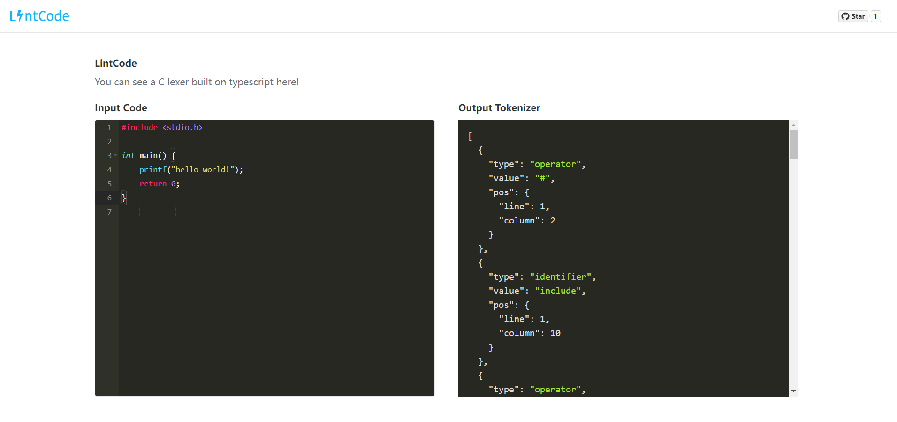

<p align="center">
    
</p>

<p align="center">
    
    
    
</p>

<div align="center">
    <p>它是一个使用 typescript 构建的 C 语言词法分析器</p>
    <p>文档：<a href="/README.zh-CN.md">中文</a> / <a href="/README.md">English</a></p>
</div>

# 词法分析器

词法分析器（Lexer，也称为扫描器）是编译器或解释器的一部分，用于将输入的源代码字符串分解成一个个称为词法单元（Tokens）的小块。每个词法单元通常代表了源代码中的一个基本语法单元，例如关键字、标识符、操作符、常量等。词法分析是编译过程的第一个阶段，它的主要任务是将复杂的源代码字符串转换为容易处理的标记流。

# 词法分析器的原理

词法分析器的原理如下:

-   词法分析器从源代码字符串中读取一个词法单元
-   词法分析器将词法单元转换为标记流

# 词法分析器的实现

用一个 Position 类来表示词法单元的位置,它包含了词法单元的行号和列号。通过它来步进词法单元。调用类中的 next() 方法来获取下一个词法单元。用 DFA(有限自动机)对不同的词法单元进行判断。最终将词法单元转换为标记流。

# 词法分析器的使用

```shell
npm install lexers
```

```typescript
import { createTokenizer } from 'lexers'

const code = `int a = 1;`

const tokenizer = crateTokenizer(code)
const tokens = tokenizer.lexer()
```

# [游乐场](https://lexer-ten.vercel.app/)

<div align="center">
    
</div>

# 贡献

### 项目统计

<a href="https://starchart.cc/xie392/lexer"></a>


### 问答
如果您有任何问题或疑问，你可以选择[提交问题](https://github.com/xie392/lexer/issues/new)。
